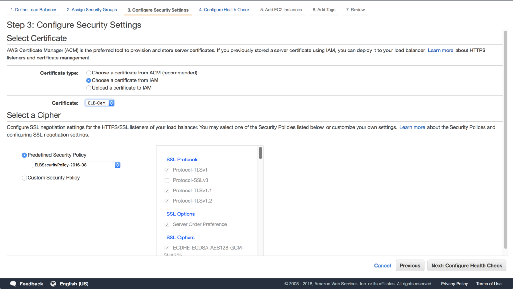
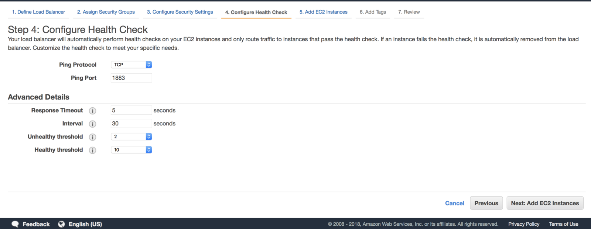
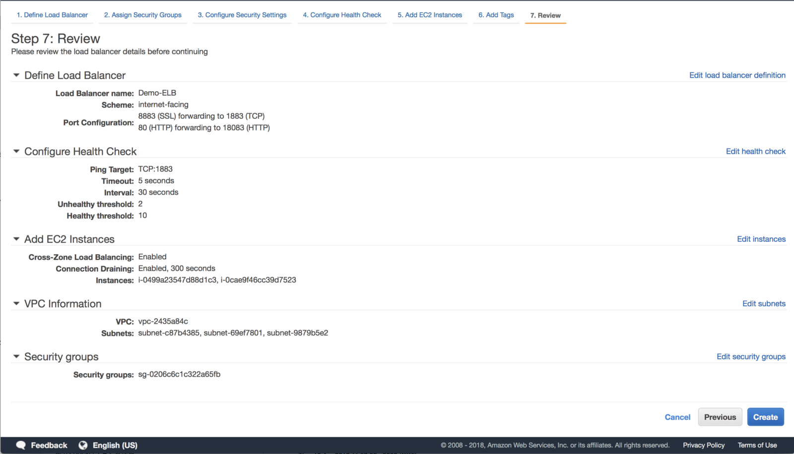

# Configure Load Balancer for EMQ X Cluster

## What Load Balancer Can Do for EMQ X Cluster

The basic function of a Load Balancer (LB) is to balance the load of multiple network components, and optimize resource usage, minimize the service response time, maximize the service ability, and avoid failures caused by overload of single or a few components.   
In a cluster, a load balancer it not obligatory, but it can bring extra advantages to the entire system, thus is is a common practice to have one in front of the service providing cluster. If we have a load balancer deployed with EMQ X cluster, it brings following benefits:

- Balancing the load of EMQ X nodes. Usually a load balancer support multiple balancing algorithms (random, roundrobin, by weight and etc), it makes full use of the nodes in cluster and lower the chance of single node over loaded.

- Simplifying the Configuration on the Client Side. If there is no load balancer, a client need to the addresses of every node to guarantee that it can connect to service even when some nodes are down. When the structure of cluster is changed, the client side must be changed accordingly. If there is a load balancer in front of EMQ X cluster, the clients don't need to know the deployment details of the cluster, it just need to connection to the load balancer.

- TLS/SSL offload. Most of the load balancers provide TLS/SSL termination function. It can be used to end the TLS/SSL connections and forward plain connections to EMQ X nodes. It lowers the load on EMQ X nodes.

- More security. When a load balancer is deployed in front of EMQ X cluster, the EMQ X nodes are not exposed to the out side directly, the architecture of internal network is unknowable to outside, thus more security.

- Other advantages. depends on the chosen load balaner, it can bring other advantages, like hardware en/decryption, health check, traffic control, DDoS elimination and etc.

There are lot choices of load balancers, like HAProxy and NGINX, the most public cloud providers also have load balancer as a service on their cloud.

We will explain how to use load balancer on public cloud and on private deployment by examples.

## Enable ELB on AWS
Amazon's AWS is one of the most used public cloud server, AWS provide their own load balancing solution, the Elastic Load Balancer (ELB). Here we will demonstrate how to configure ELB for a two-node EMQ X cluster.


### Pre-conditions
1. Two EC2 instances on AWS with EMQ X installed and clustered up.
2. Generate certificate for ELB (IF TLS/SSL is required).
3. Setup security group and make the EMQ X nodes not visible from out side.

Some contents of the pre-conditions are beyond of the scope of this document, for more information about AWS please refer to [AWS documents](https://aws.amazon.com/ec2/developer-resources/).

### Configure ELB
There are three different load balancer available on the AWS’s EC2 Management Console: the application LB, the network LB and the classic LB. Our target is to balance the network traffic and off-load the SSL, so the classic LB is the one we need here. If SSL is not necessary, we can also use a network LB in this place.


#### Define ELB
Here we assume that the MQTT SSL and EMQ X dashboard are the only service on the network.

For this purpose we will add two listener configuration items:
- LB protocol SSL on port 8883 and instance protocol TCP on port 1883
- LB protocol HTTP on port 18083 and instance protocol HTTP on port 18083


#### Assign Security Groups
Here it will let you choose creating a new security group or select an existing security group. This security group shall make the ELB accessible to outside.


#### Configure Security Settings

Here the cryptology security will be configured. It decides how the SSL should be used.



**Select Certificate**  
AWS provides two ways to manage the certificates, one is using AWS Certificate Manager (ACM), ACM provides the certificate provision and storage services. The other is AWS Identity and Access Management (IAM), IAM can manage the certificates generated by you or by a third party, if the certificates are in `pem` format.

**Select a Cipher**  
You can select to use the predefined security policy or to customize it. By choosing custom security policy, you can enable/disable the protocol version support, the SSL options and the SSL ciphers. Usually the predefined policy is secure enough, but if you know exactly what protocol version and cipher will be used by the clients, you can narrow it down.

#### Configure Health Check

If an instance failed the health check, it will be removed from the load balancing group. The health check can be done by probing on a port with a specified protocol (not an ICMP ping).


#### Add EC2 Instances

In this step the EMQ X Brokers will be added. In our case, they are two instances installed with EMQ X Broker in the same VPC. These two instances build an EMQ X cluster and configured with proper security group.

 

#### Add Tags
Add Tags


#### Review
Here we check the setup for the last time, if everything is ok, we create the ELB.


### Test the ELB
We will use mosquitto client to test our setup.  
When creating SSL connection, the mosquitto_pub checks the server side certificate, which is enabled on the ELB, against the root ca. To disable the hostname verification, we invoke the `--insecure` argument:

```bash
mosquitto_pub -h Demo-ELB-1969257698.us-east-2.elb.amazonaws.com  -t aa -m bb -d -p 8883 --cafile ~/MyRootCA.pem --insecure

Client mosqpub/1984-emq1 sending CONNECT

Client mosqpub/1984-emq1 received CONNACK

Client mosqpub/1984-emq1 sending PUBLISH (d0, q0, r0, m1, 'aa', ... (2 bytes))

Client mosqpub/1984-emq1 sending DISCONNECT
```
We can see in the above example the `mosquitto_pub` client connected to ELB via SSL and the ELB can forward this MQTT connection and message to EMQ X cluster at backend.

## Use HAProxy as Load Balancer

When deploying EMQ X cluster in proviate environment, we Usually need to setup our own load balancer. Here we use HAProxy as an example to demonstrate how to configure the load balancer for private deployment.  
How to install a HAProxy beyonds the scope of this document, for more information about HAProxy please refer to [HAProxy's site](http://www.haproxy.org/).

The configuaraion file fo HAProxy is located at `/etc/haproxy/haproxy.cfg` it may be different by different version.

### Configure the Backend for HAProxy
Roughly, a backend means the service with proceed the requests forwarded by HAProxy. Here the backends are the EMQ X nodes. There are two basic configuration for backends:
- Load balancing algorithm, usually could be one of the following:
 - roundrobin : the default algorithm
 - leastconn : forwards requests to the backend which has the least connections
 - source : forwards the requests to backend according a hash function on soure address. It makes the connection from same client sticks to one backend.
- A list of servers and ports

Config example:
```bash
backend emqx_tcp_back
    balance roundrobin
    server emqx_node_1 192.168.1.101:1883 check
    server emqx_node_2 192.168.1.102:1883 check
    server emqx_node_3 192.168.1.103:1883 check

backend emqx_dashboard_back
    balance roundrobin
    server emqx_node_1 192.168.1.101:18083 check
    server emqx_node_2 192.168.1.102:18083 check
    server emqx_node_3 192.168.1.103:18083 check

```
### Configre the frontend fo HAProxy
The frontend defines how the HAProxy receives connections and to which backend it should forward them. It defines the bind of receiving address and port, the work mode, some options and the backends.

Configuration example:
```bash
frontend emqx_tcp
    bind *:1883
    option tcplog
    mode tcp
    default_backend emqx_tcp_back

frontend emqx_dashboard
    bind *:18083
    option tcplog
    mode tcp
    default_backend emqx_dashboard_back
```
### Test the Configuration
We use mosquitto_pub to test the configuration above (`test_haproxy.emqx.io` is the HAProxy):
```bash
mosquitto_pub -h test_haproxy.emqx.io  -t aa -m bb -d -p 8883

Client mosqpub/1984-emq1 sending CONNECT

Client mosqpub/1984-emq1 received CONNACK

Client mosqpub/1984-emq1 sending PUBLISH (d0, q0, r0, m1, 'aa', ... (2 bytes))

Client mosqpub/1984-emq1 sending DISCONNECT
```
