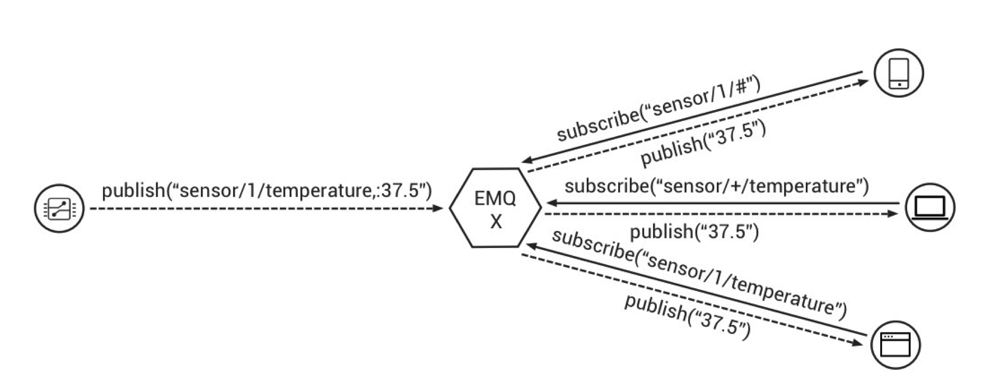

# TODO: 翻译 什么是 MQTT

MQTT 是 Message Queuing Telemetry Transport（消息队列遥测传输）的缩写，是 IBM 开发的一个即时通讯协议，它比较适合于在低带宽、不可靠的网络的进行远程传感器和控制设备通讯等，正在日益成为物联网通信协议的重要组成部分。

- 基于发布 / 订阅范式的 “轻量级” 消息协议（头部 2 字节）
- 专为资源受限的设备、低带宽占用高延时或者不可靠的网络设计，适用于 IoT 与 M2M
- 基于 TCP/IP 协议栈
- 事实的 IoT 通讯的标准协议

该协议于 1999 年由 IBM 的 Dr Andy Stanford-Clark 和 Arcom(现为 Eurotech)的 Arlen Nipper 提出，协议版本经历了多次升级和改进，于 2013 年成立 OASIS MQTT 技术规范委员会，并持续发布协议的新版本，

- 2015 年，MQTT3.1.1 协议发布
- 2018 年，MQTT5.0 协议发布

目前主流的支持协议版本为 3.1.1，但是比较活跃的 MQTT 服务器推出了支持 MQTT 5.0 协议的版本，EMQ X 今年 9 月份推出了 3.0 版本，是开源社区中最早支持 MQTT 5.0 协议的服务器。

## MQTT 协议的主要特性

- MQTT 协议使用发布 / 订阅消息范式来做到一对多的消息分发以及应用程序的解耦 
- MQTT 协议提供了 3 种（QoS）服务质量用于消息传输，适应不同的物联网数据传输场景
  - QoS 0：最多一次传送 (只负责传送，发送过后就不管数据的传送情况) 
  - QoS 1：至少一次传送 (确认数据交付) 
  - QoS 2：正好一次传送 (保证数据交付成功) 
- 通过很小的传输开销，以及最小化的协议交换来减少网络流量 
- 发生异常断线时通知各方的机制 

## MQTT 发布 / 订阅

如上图所示，

- 发布者：温度传感器，通过主题 "sensor/1/temperature" 发布一条温度为 37.5 度的消息
- 3 个自上而下的订阅者分别通过订阅不同的主题得到发布者发出的消息
  - 移动设备：通过订阅主题 "sensor/1/#"
  - 电脑：通过订阅主题 "sensor/+/temperature"
  - 服务器：通过订阅主题 "sensor/1/temperature"

## MQTT 服务器

MQTT 服务器是发布者和订阅者之间通信的代理（因此中文也有将 MQTT 服务器翻译为 MQTT 代理），主要提供了以下的功能，

- 基于主题的 Pub/Sub 模式，将发布者和订阅着解耦
- 对于服务器来说，发布者和订阅者都是“客户端”
- 客户端与服务器连接都通过 TCP、TLS 或者 WebSocket
- 客户端（发布者）发送一条消息到服务器
- 一个或者多个客户端（订阅者）从服务器接收消息

按照 MQTT 协议标准，服务器提供三种连接方式，

- TCP：默认端口为 1883
- TLS：默认端口为 8883
- WebSocket：默认端口为 8083
