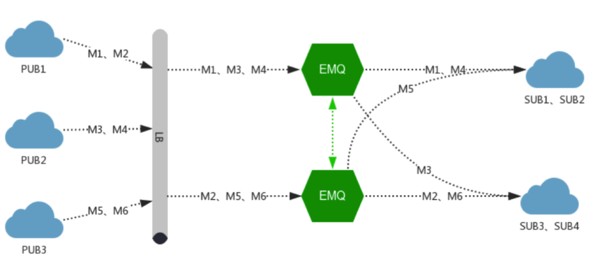
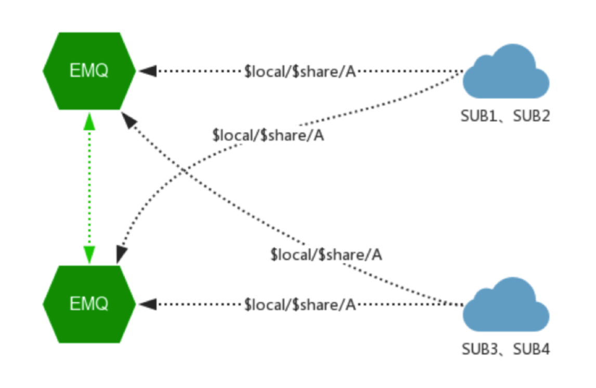

## 本地订阅


本地订阅中，EMQ X 不会为订阅创建全局路由，只会在当前节点上分发 MQTT 消息。

用法：加上主题前缀如 `$local/:topic`

```bash
# 订阅主题
$local/my_topic

# 发布到主题
my_topic
```


### 使用指南

1. 当生产者和消费者的消息只需传递到一个 EMQ X 节点时，可以使用 EMQ X 的**本地订阅**；

2. 希望消息通过 EMQ X 在订阅端的多个客户端之间实现负载均衡时，可以使用 EMQ X 的**共享订阅**；

3. 当多个生产者产生多条消息时，一个消费者分担巨大压力，或者在其他情况下，需要**本地共享订阅**。本地共享订阅是本地订阅和共享订阅的组合。

>  每个消费者必须本地订阅每个 EMQ X 节点，以便每个消息只传递给一个消费者。这里的 sub 指的是消费者，pub指的是生产者。


### 消息流

每条发布的消息从 LB（负载均衡器）发送到不同的 EMQ X 节点，例如第一个 EMQ X 节点接收到 M1、M3 和 M4 消息：

- 通过本地订阅，这个EMQ X 节点的消息把收到的M1、M3、M4的消息不发给其它集群的 EMQ X 节点，只从这个 EMQ X节点发送给订阅的 SUB;
- 通过共享订阅，这个 EMQ X 节点将收到的 M1、M3、M4 消息发送给不同的 SUB 端；
- 通过上述本地订阅+共享订阅，实现多个 PUB 发送的每条消息随机到达且只到达一个 SUB 端。





### 订阅关系

每个 SUB 使用本地共享订阅（$local/$share/A）来订阅 EMQ X 集群中的每个节点。



