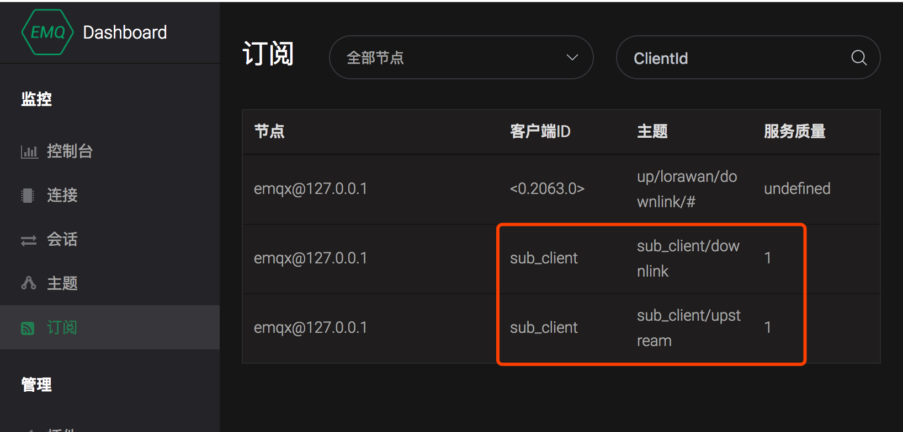
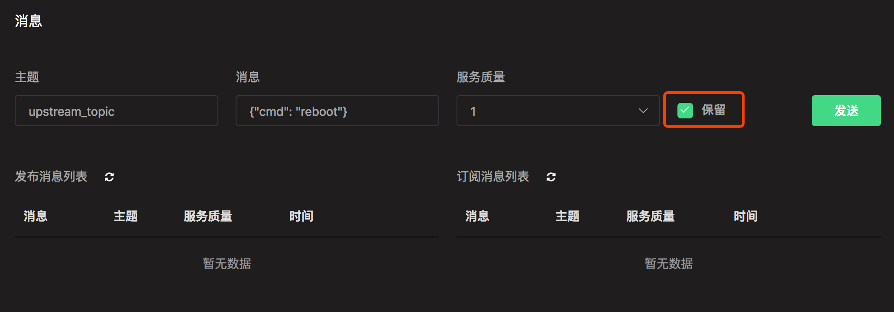

# Cassandra 数据存储

[TOC]

本章节以在 `CentOS 7.2` 中的实际例子来说明如何通过 Cassandra 来存储相关的信息。


## 安装与验证 Cassandra 服务器

读者可以参考 Cassandra [官方文档](http://cassandra.apache.org/doc/latest/) 或 [Docker](https://docs.docker.com/samples/library/cassandra/) 来下载安装 Cassandra，本文章使用 Cassandra 3.11.3 版本。


## 配置 EMQ X 服务器

通过 RPM 方式安装的 EMQ X，Cassandra 相关的配置文件位于 `/etc/emqx/plugins/emqx_backend_cassa.conf`，如果只是测试 Cassandra 持久化的功能，大部分配置不需要做更改，填入用户名、密码、keyspace 即可：

```bash
backend.ecql.pool1.nodes = 127.0.0.1:9042

backend.ecql.pool1.size = 8

backend.ecql.pool1.auto_reconnect = 1

backend.ecql.pool1.username = cassandra

backend.ecql.pool1.password = cassandra

backend.ecql.pool1.keyspace = mqtt

backend.ecql.pool1.logger = info
```

保持剩下部分的配置文件不变，然后需要启动该插件。启动插件的方式有 `命令行`和 `控制台`两种方式，读者可以任选其一。


### keyspace 初始化

在 Cassandra 上创建名为 `mqtt` 的 keyspace：

```bash
cqlsh> CREATE KEYSPACE IF NOT EXISTS mqtt WITH REPLICATION = {'class': 'SimpleStrategy','replication_factor':1};

cqlsh> describe keyspaces

system_traces  mqtt  system

cqlsh> use mqtt;
```


### 通过命令行启动

```bash
emqx_ctl plugins load emqx_backend_cassa
```


### 通过管理控制台启动

EMQ X 管理控制台 **插件** 页面中，找到 **emqx_backend_cassa** 插件，点击 **启动**。


## 客户端在线状态存储

客户端上下线时，插件将更新在线状态、上下线时间、节点客户端列表至 Cassandra 数据库。

### 数据表

创建 mqtt.client 设备在线状态表:

```sql
CREATE TABLE mqtt.client (
    client_id text,
    node text,
    state int,
    connected timestamp,
    disconnected timestamp,
    PRIMARY KEY(client_id)
);
```


### 配置项

打开配置文件，配置 Backend 规则：

```bash
## hook: client.connected、client.disconnected
## action/function: on_client_connected、on_client_disconnected


## 客户端上下线
backend.cassa.hook.client.connected.1 = {"action": {"function": "on_client_connected"}, "pool": "pool1"}

## 客户端下线
backend.cassa.hook.client.disconnected.1 = {"action": {"function": "on_client_disconnected"}, "pool": "pool1"}
```


### 使用示例

浏览器打开 `http://127.0.0.1:18083` EMQ X 管理控制台，在 **工具** -> **Websocket** 中新建一个客户端连接，指定 clientid 为 sub_client，点击连接，连接成功后手动断开:


 查看 `mqtt.client` 表，此时将写入 / 更新一条客户端上下线记录：

```bash
cqlsh:mqtt> select * from mqtt.client ;

 client_id  | connected                | disconnected | node           | state
------------+--------------------------+--------------+----------------+-------
 sub_client | 2018-11-20 01:49:20+0000 |         null | emqx@127.0.0.1 |     1

(1 rows)
```


## 客户端代理订阅

客户端上线时，存储模块直接从数据库读取预设待订阅列表，代理加载订阅主题。在客户端需要通过预定主题通信（接收消息）场景下，应用能从数据层面设定 / 改变代理订阅列表。

### 数据表

创建 mqtt.sub 设备订阅表:

```sql
CREATE TABLE mqtt.sub (
    client_id text,
    topic text,
    qos int,
    PRIMARY KEY(client_id, topic)
);
```

### 配置项

打开配置文件，配置 Backend 规则：

```bash
## hook: client.connected
## action/function: on_subscribe_lookup
backend.cassa.hook.client.connected.2    = {"action": {"function": "on_subscribe_lookup"}, "pool": "pool1"}
```


### 使用示例

当 `sub_client` 设备上线时，需要为其订阅 `sub_client/upstream` 与 `sub_client/downlink` 两个 QoS 1 的主题：

1. 在 `mqtt.sub` 表中初始化插入代理订阅主题信息：

```sql
insert into mqtt.sub(client_id, topic, qos) values('sub_client', 'sub_client/upstream', 1);
insert into mqtt.sub(client_id, topic, qos) values('sub_client', 'sub_client/downlink', 1);
```

2. EMQ X  管理控制台 **WebSocket** 页面，以 clientid `sub_client`  新建一个客户端连接，切换至**订阅**页面，可见当前客户端自动订阅了 `sub_client/upstream` 与 `sub_client/downlink` 两个 QoS 1 的主题：




3. 切换回管理控制台 **WebSocket** 页面，向 `sub_client/downlink` 主题发布消息，可在消息订阅列表收到发布的消息。


## 持久化发布消息

### 数据表

创建 mqtt.msg MQTT 消息持久化表:

```sql
CREATE TABLE mqtt.msg (
    topic text,
    msgid text,
    sender text, -- 发布的 clientid
    qos int,
    retain int,
    payload text,
    arrived timestamp, -- 发布时间
    PRIMARY KEY(topic, msgid)
  ) WITH CLUSTERING ORDER BY (msgid DESC);
```

### 配置项

打开配置文件，配置 Backend 规则，支持使用 `topic` 参数进行消息过滤，此处使用 `#` 通配符存储任意主题消息：

```bash
## hook: message.publish
## action/function: on_message_publish

backend.cassa.hook.message.publish.1     = {"topic": "#", "action": {"function": "on_message_publish"}, "pool": "pool1"}
```


### 使用示例

在 EMQ X 管理控制台 **WebSocket** 页面中，使用 clientdi `sub_client` 建立连接，向主题 `upstream_topic` 发布多条消息，EMQ X 将消息列表持久化至 `mqtt.msg` 表中：

```sql
cqlsh:mqtt> select * from mqtt.msg;

 topic          | msgid                | arrived                  | payload             | qos | retain | sender
----------------+----------------------+--------------------------+---------------------+-----+--------+------------
 upstream_topic | 2VI0ceNQJ1UPaUHki88I | 2018-11-20 01:54:40+0000 | { "cmd": "reboot" } |   1 |   null | sub_client

(1 rows)
```

>暂只支持 QoS 1 2 的消息持久化。


## Retain 消息持久化

### 表结构

创建 mqtt.retain Retain 消息表:

```sql
CREATE TABLE mqtt.retain (
    topic text,
    msgid text,
    PRIMARY KEY(topic)
);
```

### 配置项

打开配置文件，配置 Backend 规则：

```bash
## 同时开启以下规则，启用 retain 持久化三个生命周期

## 发布非空 retain 消息时 (存储)
backend.cassa.hook.message.publish.2     = {"topic": "#", "action": {"function": "on_message_retain"}, "pool": "pool1"}

## 设备订阅主题时查询 retain 消息
backend.cassa.hook.session.subscribed.2  = {"topic": "#", "action": {"function": "on_retain_lookup"}, "pool": "pool1"}

## 发布空 retain 消息时 (清除)
backend.cassa.hook.message.publish.3     = {"topic": "#", "action": {"function": "on_retain_delete"}, "pool": "pool1"}

```


### 使用示例

在 EMQ X 管理控制台 **WebSocket** 页面中建立连接后，发布消息勾选**保留**：




**发布（消息不为空）**

非空的 retain 消息发布时，EMQ X 将以 topic 为唯一键，持久化该条消息至 `mqtt.retain` 表中，相同主题下发从不同的 retain 消息，只有最后一条消息会被持久化：

```bash
cqlsh:mqtt> select * from mqtt.retain;

 topic          | msgid                
----------------+----------------------
 upstream_topic | 2VI0fSdsg79YegwFTMDz 
```


**订阅**

客户端订阅 retain 主题后，EMQ X 将查询 `mqtt.retain` 表，执行投递 retain 消息操作。


**发布（消息为空）**

MQTT 协议中，发布空的 retain 消息将清空 retain 记录，此时 retain 记录将从 `mqtt.retain` 表中删除。


## 消息确认持久化

开启消息确认 (ACK) 持久化后，客户端订阅 QoS 1、QoS 2 级别的主题时，EMQ X 将在数据库以 clientid + topic 为唯一键初始化 ACK 记录。

### 数据表

创建 mqtt.acked  客户端消息确认表:

```sql
CREATE TABLE mqtt.acked (
    client_id text,
    topic text,
    msgid text,
    PRIMARY KEY(client_id, topic)
  );
```

### 配置项

打开配置文件，配置 Backend 规则，可使用 **topic 通配符** 过滤要应用的消息：

```bash
## 订阅时初始化 ACK 记录
backend.cassa.hook.session.subscribed.1  = {"topic": "#", "action": {"function": "on_message_fetch"}, "pool": "pool1"}


## 消息抵达时更新抵达状态
backend.cassa.hook.message.acked.1       = {"topic": "#", "action": {"function": "on_message_acked"}, "pool": "pool1"}

## 取消订阅时删除记录行
backend.cassa.hook.session.unsubscribed.1= {"topic": "#", "action": {"cql": ["delete from acked where client_id = ${clientid} and topic = ${topic}"]}, "pool": "pool1"}
```


### 使用示例

在 EMQ X 管理控制台 **WebSocket** 页面中建立连接后，订阅 QoS > 0 的主题：


此时 `mqtt.acked` 表将插入初始化数据行：

```bash
cqlsh:mqtt> select * from mqtt.acked;

 client_id  | topic          | msgid
------------+----------------+----------------------
 sub_client | upstream_topic | 2VI0o9gul3jAXzYE9q4f

(1 rows)
```


> 代理订阅中满足 QoS > 0 的 topic 也会初始化记录，客户端取消订阅后相关记录将被删除。


## 高级选项

```bash
backend.mongo.time_range = 5s

backend.mongo.max_returned_count = 500
```


## 总结

读者在理解了 Cassandra 中所存储的数据结构之后，可以结合 Cassandra 拓展相关应用。

