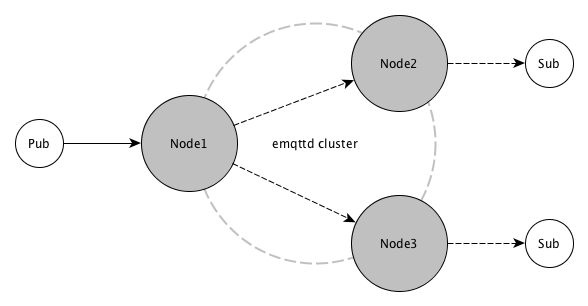

# EMQ X 的集群概念

集群是指通过组合一组计算机软硬件来协同完成计算任务，这些软硬件之间通过网络连接。组成一个集群的软硬件可以有相同、相似或完全不同的结构和功能。从外部来看，一个集群可以被看作一个整体而无需了解集群内部的细节就可以使用集群提供的服务。通常，一个集群可以提供比单个计算机更高的处理速度、数据吞吐量和可靠性。

在集群中的每个单独的能独立工作的软硬件模块，称之为一个节点。

EMQ X 支持集群。多台 EMQ X 服务器可以工作在集群模式下，各个服务器之间通过TCP网络相连，其中每个 EMQ X 服务器就是一个节点。  
相对于单服务器，EMQ X 集群能通过多台服务器之间的协作带来以下优势：
- 高可用性：在单机模式下，如果服务器故障停机，则整个 EMQ X 提供的消息服务也就随之中断，整个应用服务也随之不可用。在集群模式下，单台或少量的服务器故障并不会导致整个消息服务中断，其余的正常工作的节点可以继续提供服务。
- 负载均衡：通过负载均衡机制，EMQ X 集群可以把负载平均的分布在各个节点。
- 更高的整体性能：相比单机部署，多节点的 EMQ X 集群能够成倍的提升整个系统的连接和消息处理能力。
- 可扩展性：当应用需要更强的处理能力的时候，可以通过在集群中添加新节点的方式来完成扩容而无需停机。

## 基于 Erlang/OTP 的 EMQ X集群
EMQ X 使用Erlang/OTP 平台。Erlang/OTP 最初是为了开发电信设备系统而设计的编程语言平台，在设计时就将集群特性作为一项重要的特性纳入考虑，以 Erlang/OTP 实现的分布式系统在集群上基本都是简单易用而又高效可靠，EMQ X 也不例外。
```
---------         ---------
| Node1 | --------| Node2 |
---------         ---------
    |     \     /    |
    |       \ /      |
    |       / \      |
    |     /     \    |
---------         ---------
| Node3 | --------| Node4 |
---------         ---------
```
当某个客户端连接到 EMQ X 集群的一个节点后，他所订阅的主题会被通知到其他节点，他所发布的消息也会被所有节点上订阅了相应主题的客户端收到。用户无需关心其中的实现细节。对于用户而言，这一切都是透明和自动的。

### 节点
集群中的每台 EMQ X 服务器就是一个节点。在集群内部的通讯中，节点由一个唯一的节点名标识。节点名的格式为 `name@host`，其中`name`由用户指定，`host`是IP地址或者全程域名（FQDN，Fully Qualified Domain Name）。
比如：
```
emqx1@192.168.1.165
emqx2@broker1.emqx.io
```
### 节点间通讯
EMQ X 集群使用epmd来映射节点名称到TCP端口，如果集群所在网络内部有防火墙等过滤机制，需要在上面允许相应的端口通讯。

EMQ X 使用 Erlang/OTP 的 magic cookie机制来确认同一个集群之间的互联。只需要在要加入集群的节点上设置相同的cookie字串即可。

集群内部的通讯可以是 TCPv4 或者 TCPv6，支持TLS方式。

## EMQ X 集群处理MQTT协议的方式
EMQ X 集群处理MQTT的基本原则可以概括为以下两点：
- MQTT 客户端订阅主题时，所在节点订阅成功后广播通知其他节点：某个主题(Topic)被本节点订阅。
- MQTT 客户端发布消息时，所在节点会根据消息主题(Topic)，检索订阅并路由消息到相关节点。

EMQ X 消息服务器同一集群的所有节点，都会复制一份主题(Topic) -> 节点(Node)映射的路由表，例如一个简单的路由表可以是这样的:
```
topic1 -> node1, node2
topic2 -> node3
topic3 -> node2, node4
```
### 主题树(Topic Trie)与路由表(Route Table)
在EMQ X 集群的每个节点，都会保存一份主题树和路由表。

如果在集群中有如下的主题订阅关系：

| 客户端    | 所在节点 | 订阅主题       |
|----------|---------|--------------|
| client1  | node1   | t/+/x, t/+/y |
| client2  | node2   | t/#          |
| client3  | node3   | t/+/x, t/a   |

最终会生成如下的主题树和路由表：
```
--------------------------
|             t          |
|            / \         |
|           +   #        |
|         /  \           |
|       x      y         |
--------------------------
| t/+/x -> node1, node3  |
| t/+/y -> node1         |
| t/#   -> node2         |
| t/a   -> node3         |
--------------------------
```

### 订阅与消息派发
客户端的主题订阅(Subscription)关系，只保存在客户端所在节点，用于本节点内派发消息到客户端。

例如client1向主题’t/a’发布消息，消息在节点间的路由与派发流程:
```
client1->node1: Publish[t/a]
node1-->node2: Route[t/#]
node1-->node3: Route[t/a]
node2-->client2: Deliver[t/#]
node3-->client3: Deliver[t/a]
```

