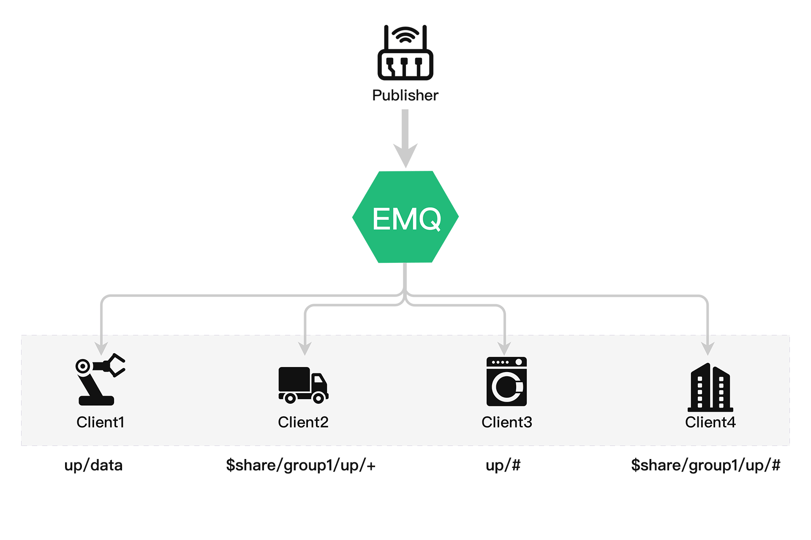

## 共享订阅

MQTT 基于 PUB/SUB 消息模式，同一消息可以分发到多个客户端。当单个客户端很难处理大量消息时，需要一个更高级的消息模式和客户端负载均衡机制：共享订阅。

共享订阅是一种机制，允许将订阅组的消息分发均匀地分发给订阅组成员。在共享订阅中，订阅同一主题的客户机依次接收此主题下的消息。同一消息不会发送给多个订阅客户端，从而实现多个订阅客户端之间的负载均衡。




共享订阅在数据收集/集中处理应用程序中效率很高。数据的生产者数量远不止数据的消费者数量时，同样的数据只需要在任何消费者端处理一次。


### 使用指南

您可以使用任何 MQTT 客户端在 EMQ X 上启用共享订阅。

创建共享订阅的两种方法：

| 主题前缀             | 实例                       |
| -------------------- | -------------------------- |
| $queue/:topic        | sub `$queue/up/data`       |
| $share/:group/:topic | sub `$share/group/up/data` |

共享订阅由三部分组成：

- 静态共享订阅标识符（$queue 与 \$share）

- 组标识符（可选）

- 特定标准 MQTT 主 题（实际接收消息的主题）

  

### \$queue 和 $share 之间的差异：

$queue 之后的主题中所有消息将轮流发送到客户端，

\$share 之后，您可以添加不同的组，例如:

  - $share/group_1/topic
  - \$share/group_2/topic
  - ​$share/group_3/topic

当 EMQ X 向 topic 发送消息时，每个组都会收到该消息，并依次将其发送到该组中的设备。


### 代码示例

MQTT 客户端可以轻松实现共享订阅。下面的 Node.js 代码显示了两个客户端订阅

```js
const mqtt = require('mqtt')

const clientOne = mqtt.connect('mqtt://q.emqx.io:1883')
const clientTwo = mqtt.connect('mqtt://q.emqx.io:1883')
const clientThree = mqtt.connect('mqtt://q.emqx.io:1883')

// 设备 1 订阅
clientOne.on('connect', () => {
    console.log('设备 1 已连接')
    clientOne.subscribe('$share/group_one/up/data')
})
clientOne.on('message', (topic, message) => {
    console.log('设备 1 收到消息, topic:', topic, ', payload :', message.toString())
})


// 设备 2 订阅
clientTwo.on('connect', () => {
    console.log('设备 2 已连接')
    clientTwo.subscribe('$share/group_one/up/+')
})
clientTwo.on('message', (topic, message) => {
    console.log('设备 2 收到消息, topic:', topic, ', payload :', message.toString())
})


// 设备 3 向目标主题发布数据
clientThree.on('connect', () => {
    let i = 0
    setInterval(() => {
        clientThree.publish('up/data', i)
        i++
    }, 1000)
})

```


设备 1 和 设备 2 将在启动后依次接收消息：

```bash
// 输出结果
设备 1 收到消息, topic: up/data , payload : 0
设备 2 收到消息, topic: up/data , payload : 1
设备 1 收到消息, topic: up/data , payload : 2
....
```

客户端可以随时订阅或取消订阅订阅组，如果另一个客户端加入该组，则每个客户端将接收该主题下 1/3 的 MQTT 消息。