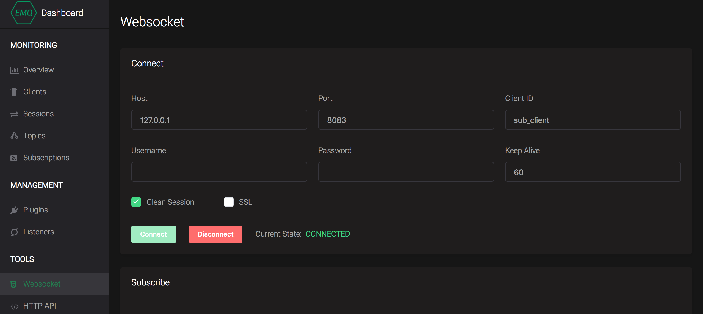

# MongoDB 数据存储

本章节以在 `CentOS 7.2` 中的实际例子来说明如何通过 MongoDB 来存储相关的信息。


## 安装与验证 MongoDB 服务器

读者可以参考 MongoDB [官方文档](https://docs.mongodb.com/) 或 [Docker](https://hub.docker.com/_/mongo/) 来下载安装 MongoDB，本文章使用 MongoDB 3.6.9 版本。


## 配置 EMQ X 服务器

通过 RPM 方式安装的 EMQ X，MongoDB 相关的配置文件位于 `/etc/emqx/plugins/emqx_backend_mongo.conf`，如果只是测试 MongoDB 持久化的功能，大部分配置不需要做更改，填入用户名、密码、数据库即可：

```bash
## MongoDB 拓扑模式
backend.mongo.pool1.type = single

backend.mongo.pool1.server = 127.0.0.1:27017

backend.mongo.pool1.c_pool_size = 8

backend.mongo.pool1.database = mqtt


## 认证信息，生产环境请务必开启数据库认证或在防火墙配置相关安全规则

## backend.mongo.pool1.login =  emqx

## backend.mongo.pool1.password = emqx

## backend.mongo.pool1.auth_source = emqx

## backend.mongo.pool1.ssl = false
```

保持剩下部分的配置文件不变，然后需要启动该插件。启动插件的方式有 `命令行`和 `控制台`两种方式，读者可以任选其一。


### 数据库集合初始化

MongoDB 集合可由数据操作时自动创建，此处为兼顾性能，预先创建集合并设置索引：

```bash
use mqtt

db.createCollection("mqtt_client")
db.createCollection("mqtt_sub")
db.createCollection("mqtt_msg")
db.createCollection("mqtt_retain")
db.createCollection("mqtt_acked")

db.mqtt_client.ensureIndex({clientid:1, node:2})
db.mqtt_sub.ensureIndex({clientid:1})
db.mqtt_msg.ensureIndex({sender:1, topic:2})
db.mqtt_retain.ensureIndex({topic:1})
```

当前集合信息：

```bash
> show collections;
mqtt_acked
mqtt_client
mqtt_msg
mqtt_retain
mqtt_sub
```


### 通过命令行启动

```bash
emqx_ctl plugins load emqx_backend_mongo
```


### 通过管理控制台启动

EMQ X 管理控制台 **插件** 页面中，找到 **emqx_backend_mongo** 插件，点击 **启动**。


## 客户端在线状态存储

客户端上下线时，插件将更新在线状态、上下线时间、节点客户端列表至 MongoDB 数据库。

### 配置项

打开配置文件，配置 Backend 规则：

```bash
## hook: client.connected、client.disconnected
## action/function: on_client_connected、on_client_disconnected


## 客户端上下线
backend.mongo.hook.client.connected.1 = {"action": {"function": "on_client_connected"}, "pool": "pool1"}

## 客户端下线
backend.mongo.hook.client.disconnected.1 = {"action": {"function": "on_client_disconnected"}, "pool": "pool1"}
```


### 使用示例

浏览器打开 `http://127.0.0.1:18083` EMQ X 管理控制台，在 **工具** -> **Websocket** 中新建一个客户端连接，指定 clientid 为 sub_client，点击连接，连接成功后手动断开:




 查看 `mqtt_client` 集合，此时将写入 / 更新一条客户端上下线记录：

```bash
> db.mqtt_client.find()
{ 
    "_id" : ObjectId("5bf283933afba9bd23c7eb4e"), 
    "clientid" : "sub_client", 
    "node" : "emqx@127.0.0.1",  ## 连接 Node
    "offline_at" : null, 
    "online_at" : 1542620041,  # 上线时间戳
    "state" : 1  ## 在线状态 0 离线 1 在线
}
```


## 客户端代理订阅

客户端上线时，存储模块直接从数据库读取预设待订阅列表，代理加载订阅主题。在客户端需要通过预定主题通信（接收消息）场景下，应用能从数据层面设定 / 改变代理订阅列表。


### 配置项

打开配置文件，配置 Backend 规则：

```bash
## hook: client.connected
## action/function: on_subscribe_lookup
backend.mongo.hook.client.connected.2    = {"action": {"function": "on_subscribe_lookup"}, "pool": "pool1"}
```


### 使用示例

当 `sub_client` 设备上线时，需要为其订阅 `sub_client/upstream` 与 `sub_client/downlink` 两个 QoS 1 的主题：

1. 在 `mqtt_sub` 集合中初始化插入代理订阅主题信息：

```bash
db.mqtt_sub.insert({clientid: "sub_client", topic: "sub_client/upstream", qos: 1})
db.mqtt_sub.insert({clientid: "sub_client", topic: "sub_client/downlink", qos: 1})
```

2. EMQ X  管理控制台 **WebSocket** 页面，以 clientid `sub_client`  新建一个客户端连接，切换至**订阅**页面，可见当前客户端自动订阅了 `sub_client/upstream` 与 `sub_client/downlink` 两个 QoS 1 的主题：


3. 切换回管理控制台 **WebSocket** 页面，向 `sub_client/downlink` 主题发布消息，可在消息订阅列表收到发布的消息。


## 持久化发布消息

### 配置项

打开配置文件，配置 Backend 规则，支持使用 `topic` 参数进行消息过滤，此处使用 `#` 通配符存储任意主题消息：

```bash
## hook: message.publish
## action/function: on_message_publish

backend.mongo.hook.message.publish.1     = {"topic": "#", "action": {"function": "on_message_publish"}, "pool": "pool1"}
```


### 使用示例

在 EMQ X 管理控制台 **WebSocket** 页面中，使用 clientdi `sub_client` 建立连接，向主题 `upstream_topic` 发布多条消息，EMQ X 将消息列表持久化至 `mqtt_msg` 集合中：

```bash
## 所有消息
> db.mqtt_msg.find()
{ 
    "_id" : 1, 
    "topic" : "upstream_topic", 
    "msgid" : "2VHdzuz3FAgTcXgCDNx4", 
    "sender" : "sub_client", ## 消息 pub clientid 
    "qos" : 1, 
    "retain" : 0, 
    "payload" : { "cmd" : "reboot" },  ## payload 根据消息类型而不同
    "arrived" : 1542620411 ## 消息到达服务器时间戳
}

## 根据 clientid 查询消息
> db.mqtt_msg.find({ sender: 'sub_client' })
{ 
    "_id" : 1, 
    "topic" : "upstream_topic", 
    "msgid" : "2VHdzuz3FAgTcXgCDNx4", 
    "sender" : "sub_client", ## 消息 pub clientid 
    "qos" : 1, 
    "retain" : 0, 
    "payload" : { "cmd" : "reboot" },  ## payload 根据消息类型而不同
    "arrived" : 1542620411 ## 消息抵达时间戳
}
```

>暂只支持 QoS 1 2 的消息持久化。


## Retain 消息持久化

### 配置项

打开配置文件，配置 Backend 规则：

```bash
## 同时开启以下规则，启用 retain 持久化三个生命周期

## 发布非空 retain 消息时 (存储)
backend.mongo.hook.message.publish.2     = {"topic": "#", "action": {"function": "on_message_retain"}, "pool": "pool1"}

## 设备订阅主题时查询 retain 消息
backend.mongo.hook.session.subscribed.2  = {"topic": "#", "action": {"function": "on_retain_lookup"}, "pool": "pool1"}

## 发布空 retain 消息时 (清除)
backend.mongo.hook.message.publish.3     = {"topic": "#", "action": {"function": "on_retain_delete"}, "pool": "pool1"}

```


### 使用示例

在 EMQ X 管理控制台 **WebSocket** 页面中建立连接后，发布消息勾选**保留**：


**发布（消息不为空）**

非空的 retain 消息发布时，EMQ X 将以 topic 为唯一键，持久化该条消息至 `mqtt_retain` 集合中，相同主题下发从不同的 retain 消息，只有最后一条消息会被持久化：

```bash
> db.mqtt_retain.find()

{ 
    "_id" : ObjectId("5bf285ed3afba9bd23c7ed60"), 
    "topic" : "upstream_topic", 
    "arrived" : 1542620642,  ## 到达服务器时间
    "msgid" : "2VHe5TZroQWAWbkMWedF", 
    "payload" : "{ \"cmd\": \"reboot\" }", 
    "qos" : 1, 
    "sender" : "sub_client"  ## 消息 pub clientid
}
```


**订阅**

客户端订阅 retain 主题后，EMQ X 将查询 `mqtt_retain` 集合，执行投递 retain 消息操作。


**发布（消息为空）**

MQTT 协议中，发布空的 retain 消息将清空 retain 记录，此时 retain 记录将从 `mqtt_retain` 集合中删除。


## 消息确认持久化

开启消息确认 (ACK) 持久化后，客户端订阅 QoS 1、QoS 2 级别的主题时，EMQ X 将在数据库以 clientid + topic 为唯一键初始化 ACK 记录。


### 配置项

打开配置文件，配置 Backend 规则，可使用 **topic 通配符** 过滤要应用的消息：

```bash
## 订阅时初始化 ACK 记录
backend.mongo.hook.session.subscribed.1  = {"topic": "#", "action": {"function": "on_message_fetch"}, "pool": "pool1"}


## 消息抵达时更新抵达状态
backend.mongo.hook.message.acked.1       = {"topic": "#", "action": {"function": "on_message_acked"}, "pool": "pool1"}

## 取消订阅时删除记录行
backend.mongo.hook.session.unsubscribed.1= {"topic": "#", "action": {"function": "on_acked_delete"}, "pool": "pool1"}
```


### 使用示例

在 EMQ X 管理控制台 **WebSocket** 页面中建立连接后，订阅 QoS > 0 的主题：


此时 `mqtt_acked` 集合将插入初始化数据行，每向主题发布一条 QoS > 0 的消息，消息抵达后数据行 mongo_id 将自增 1：

```bash
{ "_id" : ObjectId("5bf286ccdf489d65be000001"), "clientid" : "sub_client", "topic" : "sub_client/upstream", "mongo_id" : 0 }

{ "_id" : ObjectId("5bf286cddf489d65be000002"), "clientid" : "sub_client", "topic" : "sub_client/downlink", "mongo_id" : 0 }

{ "_id" : ObjectId("5bf286ecdf489d65be000003"), "clientid" : "sub_client", "topic" : "upstream_topic", "mongo_id" : 2 }
```


> 代理订阅中满足 QoS > 0 的 topic 也会初始化记录，客户端取消订阅后相关记录将被删除。


## 高级选项

```bash
backend.mongo.time_range = 5s

backend.mongo.max_returned_count = 500
```


### MongoDB 集群

配置 `Mongo Topology Options` 相关信息以支持 MongoDB 集群，相关信息见 [MongoDB 分片文档](https://docs.mongodb.com/manual/sharding/)。


## 总结

读者在理解了 MongoDB 中所存储的数据结构之后，可以结合 MongoDB 拓展相关应用。MogoDB 默认不设置任何连接验证，生产环境请务必注意 MongoDB 安全性配置。

