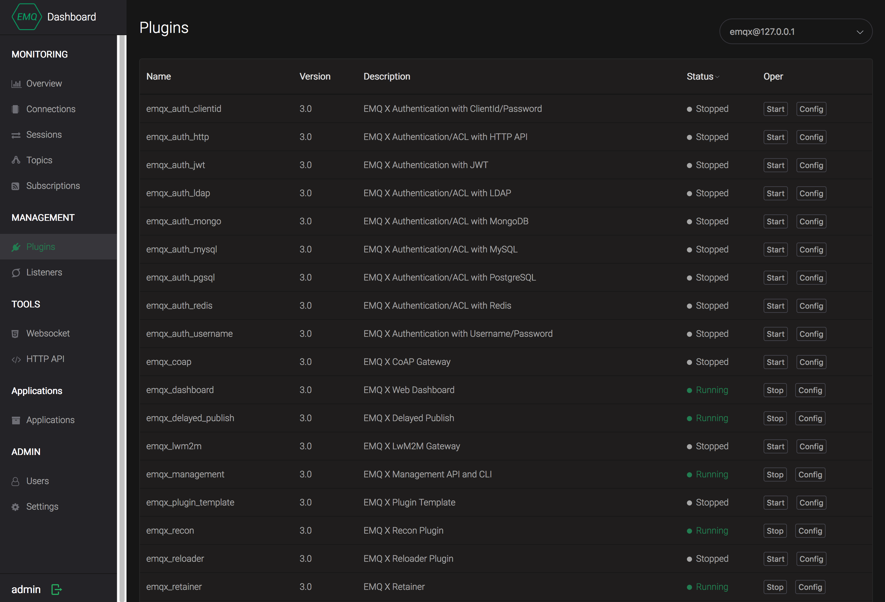

# 首次运行 EMQ X
在安装以后您可以直接运行 EMQ X 来获得最初步的经验。除了在控制台，您也可以通过浏览器访问 http://127.0.0.1:18083 来使用 EMQ X 的 Web 管理控制界面。默认的登录名是 admin 和密码是 public。

通过浏览器访问 http://127.0.0.1:18083，您将看到一个 EMQ X 登录界面：


在输入用户名和密码后，您就可以使用 EMQ X Dashboard 的各项功能。在首次登入后，您看到的将是 EMQ X 控制台的信息汇总。这个页面显示了系统信息，节点信息，运行统计和一些统计指标。


您也可以对 EMQ X 做些简单的配置，让它适配您的运行环境和需求。

## 对 EMQ X 进行简单的配置

所有对 EMQ X 的配置都可以通过修改配置文件完成。配置文件的位置：
- etc/emqx.conf : EMQ X 服务器的参数设置
- etc/plugins/\*.conf : EMQ X 插件配置文件，每个插件都有单独的配置文件。

一些常用功能的配置也在 Web Dashboard 上进行修改。

### 更改 Dashboard 界面语言
在 Web 界面上选择 ADMIN -> Settings 菜单，您可以改变 Dashboard 使用的语言，点击 Apply 后生效。目前 EMQ X 支持中文和英文。


### 修改 Dashboard 默认登录名和密码
Dashboard 插件以 Web 界面的方式提供对 EMQ X 的管理和控制功能，是 EMQ X 的默认随系统启动的插件之一。在安装以后，您可以通过编辑配置文件的方式来改变 Dashboard 默认的用户名和密码。
配置文件：
```bash
etc/plugins/emqx_dashboard.conf
```
修改以下两行内容，将等号右侧值改为需要的值：
```
dashboard.default_user.login = admin
dashboard.default_user.password = public
```
或者以 Web 方式管理 Dashboard 用户。在 ADMIN -> Users 菜单下，您可以修改用户密码和增加 / 删除用户。admin 用户只能修改密码，不能被删除。

### 配置端口
在安装以后，EMQ X 默认会使用以下端口：

- 1883: MQTT 协议端口
- 8883: MQTT/SSL 端口
- 8083: MQTT/WebSocket 端口
- 8080: HTTP API 端口
- 18083: Dashboard 管理控制台端口

按照安装环境需要，可以修改以上端口。  

修改协议端口请编辑 EMQ X 系统配置文件'etc/emqx.conf'，找到以下各行，并按需要修改端口号：
```
listener.tcp.external = 0.0.0.0:1883

listener.ssl.external = 8883

listener.ws.external = 8083
```
修改 HTTP API 端口请编辑 emqx_management 插件的配置文件'etc/plugins/emqx_management.conf'，找到下述行，并按需修改端口号：
```
management.listener.http = 8080
```
修改 Dashboard 管理控制台端口请编辑 emqx_dashboard 插件的配置文件'etc/plugins/emqx_dashboard.conf', 找到下述行，并按需修改端口号：
```
dashboard.listener.http = 18083
```
在 Web Dashboard 的 MANAGEMENT -> Listeners 菜单下，可以查看现在正在使用的监听器端口和属性。


### 启动 / 停止插件

插件是 EMQ X 的重要部分，EMQ X 的扩展功能基本都是通过插件实现的。包括 Dashbard 也是插件实现。您可以通过随软件附带的命令行工具 `emqx_ctl` 来启动和停止各个插件。

启动插件:
```bash
bin/emqx_ctl plugins load plugin_name
```
停止插件：

```bash
bin/emqx_ctl plugins unload plugin_name
```

您也可以在 Dashboard 的 MANAGEMENT -> plugins 菜单下启动和停止插件，或对插件进行简单的配置。


*EMQ X 的 Dashboard 本身也是一个插件，如果您在 Web 界面下停止了 Dashboard 插件，您将无法再使用 dashboard，直至您使用命令行工具再次启动 Dashboard。*

### 修改 Erlang 虚拟机启动参数
EMQ X 运行在 Erlang 虚拟机上，在'etc/emqx.conf'中有两个限定了虚拟机允许的最大连接数。在运行 EMQ X 前可以修改这两个参数以适配连接需求：
- node.process_limit : Erlang 虚拟机允许的最大进程数，EMQ X 一个连接会消耗 2 个 Erlang 进程;
- node.max_ports : Erlang 虚拟机允许的最大 Port 数量，EMQ X 一个连接消耗 1 个 Port

* 在 Erlang 虚拟机中的 Port 概念并不是 TCP 端口，可以近似的理解为文件句柄。*

这连个参数可以设置为：
- node.process_limit： 大于最大允许连接数 * 2  
- node.max_ports： 大于最大允许连接数
