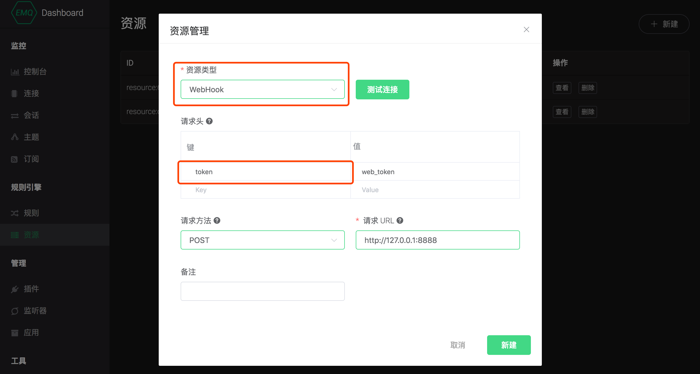
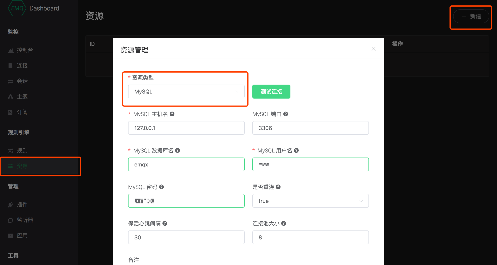
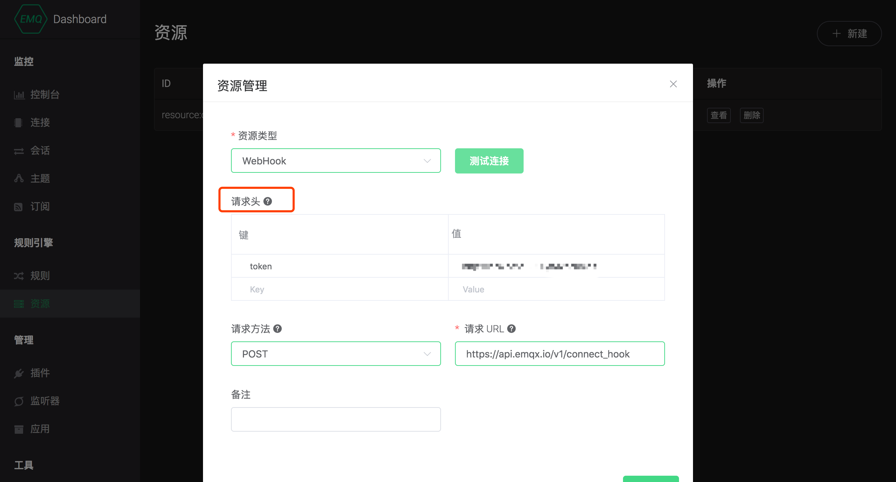
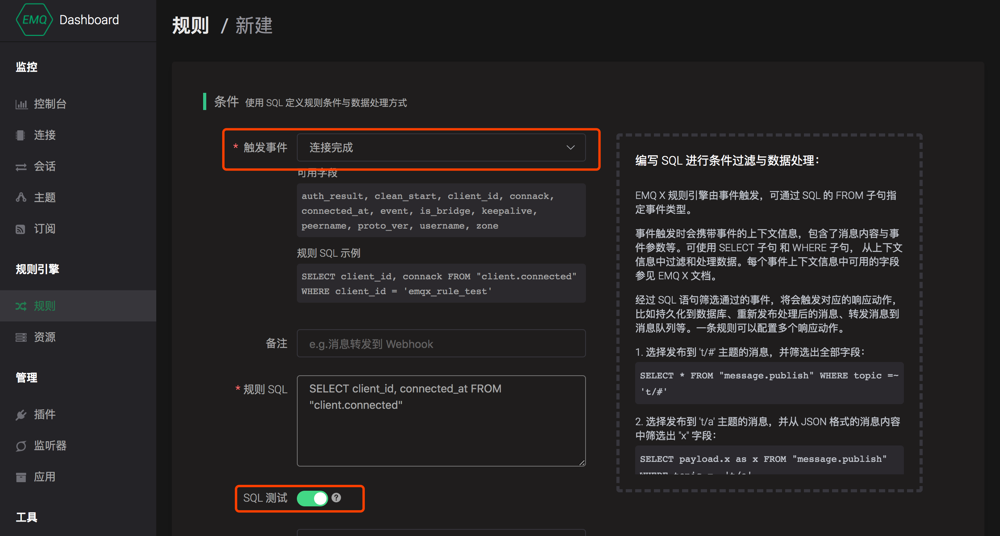
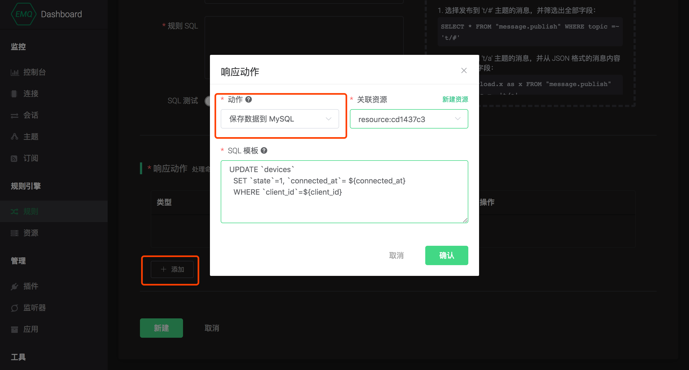
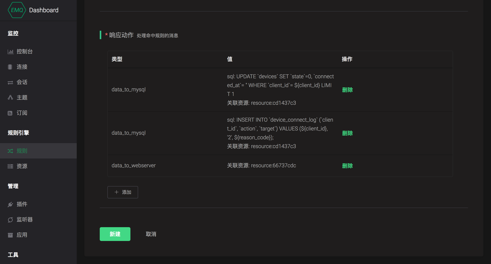

# 配置实例

> 兼容提示: EMQ X v4.0 对规则引擎 SQL 语法做出较大调整，v3.x 升级用户请参照[迁移指南](./rule_engine.md#迁移指南)进行适配。

本篇提供两个示例，通过 Dashboard 可视化界面演示规则引擎的创建于使用。


## 示例一：通过 Web Server 持久化消息到磁盘/数据库

### 场景描述

该场景中拟设车联网卡车车载传感器通过 `/monitor/:device_id/state` 主题上报如下 JSON 消息(device_id 为车辆连接客户端的 clientid，同车辆 ID)：

```js
{
  "speed": 20, // 实时车速(千米/小时)
  "lng": 102.8622543812, // 位置经度
  "lat": 24.8614503916, // 位置纬度
  "load": 1200101 // 载重量(千克)
}
```

规则引擎需要将车速大于 60 km/h 的数据发送到 Web Server 进行持久化处理，以便后期结合地理位置进行是否超速判定。

> 使用 Web Server 持久化设备消息从吞吐性能与消息一致性上考量都略显不足，此处仅为规则引擎体验示例，如有相关场景请尝试数据桥接、直接持久化到数据库等方案。


### 准备

#### 编写 HTTP 接口，准备接收并处理规则引擎的消息

该部分示例代码如下：

```js
'use strict'
const http = require('http')
const execSync = require('child_process').execSync
// 初始化全局变量用于计数
let msg_num = 0
http.createServer((req, res) => {

  const { token } = req.headers
  console.log('message coming', 'token:', token)
  // 简单的认证
  if (!token || token !== 'web_token') {
    return res.end('-1')
  }
  let body = ''
  req.on('data', (data) => {
    body = body + data
  })
  req.on('end', () => {
    body = body.toString()
    try {
      const message = JSON.parse(body)
      // 附加时间戳
      /** @type {number} */
      message.ts = Date.now()
      message.index = msg_num
      // 持久化数据到磁盘，实际根据业务处理
      execSync(`echo '${JSON.stringify(message)}' >> message.log`)
      msg_num = msg_num + 1
      res.end(msg_num.toString())
    } catch (e) {
      res.end('-1')
    }
  })
}).listen(8888, () => {
  console.log('Listen on 8888')
}) // 监听 8888 端口

```


#### 本地启动服务

使用 Node.js 快速在本地启动服务器

```bash
node app.js
> Listen on 8888
```

>  此处使用依赖极简代码示例，实际开发中应当有完备的权限校验、数据校验操作。


### 在资源中创建持久化 API 接口

在 **Dashboard** --> **规则引擎** -->  **资源** 页面点击右上角，点击 **新建** 按钮，选择 WebHook 资源类型，填入接入地址与认证信息：




### 创建规则

资源创建完毕后我们可以进行规则创建，**规则引擎** --> **规则** 页面中点击 **新建** 按钮进入规则创建页面。

#### 触发事件选择

选择 **消息发布** 事件，处理卡车消息上报(发布)时的数据。本示例中我们需要存储的消息如下：

```js
{
  "speed": 20, // 实时车速(千米/小时)
  "lng": 102.8622543812, // 位置经度
  "lat": 24.8614503916, // 位置纬度
  "device_id": "" // 车辆 ID 信息
}
```

根据 **可用字段** 提示，`device_id` 字段相当于 clientid 可以从上下文中选取，`speed` 等信息则从 `payload` 中选取，规则 SQL 如下：

```sql
SELECT 
  payload.speed AS speed, 
  payload.lng AS lng, 
  payload.lat AS lat, 
  clientid AS device_id 
FROM "#"
```

该条规则默认处理全部的消息，实际上业务仅需处理 `/monitor/+/state`  主题下的消息(使用了主题通配符)，且 `speed` 的值应当大于 60，我们给规则加上限定条件：

```sql
SELECT 
  payload.speed AS speed, 
  payload.lng AS lng, 
  payload.lat AS lat, 
  clientid AS device_id 
FROM "/monitor/+/state"
WHERE
  speed > 60
```

使用 SQL 测试功能，输入原始上报数据与相关变量，设置 `speed > 60` 之后，得到如下输出结果：

```json
{
  "speed": 89,
  "lng": 102.8622543812,
  "lat": 24.8614503916,
  "device_id": "emqx_c"
}
```


#### 将消息发送到 Web Server

新建响应动作并选取 **发送数据到 Web 服务**，选择准备工作中创建的资源，保存该条规则。


### 示例测试

我们成功创建了一条规则，一共包含一个处理动作，动作期望效果如下：

- 向 `/monitor/+/state` 主题发布消息时，当消息体是符合预期的 JSON 格式且 `speed` 数值大于 60，规则将命中并向 Web Server 处理后的消息，Web Server 根目录下 `message.log` 文件将新增新增写入该条数据。


#### 使用 Dashboard 中的 Websocket 工具测试

切换到 **工具** --> **Websocket** 页面，客户端 ID，用户名，密码均填写 `emqx_c` 模拟设备接入：


连接成功后向 `/monitor/emqx_c/state` 主题发送如下消息：

```json
{
  "speed": 20,
  "lng": 102.8622543812,
  "lat": 24.8614503916,
  "load": 1200101
}
```

由于 `speed` 小于预设的 60，查看持久化文件  `message.log` 该条消息并未命中规则。

调整 `speed` 值为 90，单击发送按钮三次，查看文件  `message.log` 中持久化的消息内容如下：

```json
{"speed":90,"lng":102.8622543812,"lat":24.8614503916,"device_id":"emqx_c","ts":1559711462746,"index":0}
{"speed":90,"lng":102.8622543812,"lat":24.8614503916,"device_id":"emqx_c","ts":1559711474487,"index":1}
{"speed":90,"lng":102.8622543812,"lat":24.8614503916,"device_id":"emqx_c","ts":1559711475219,"index":2}
```


至此，我们实现了通过 Web Server 持久化消息到磁盘的业务开发。


## 示例二：设备在线状态记录与上下线通知


### 场景描述

该场景中需要标记接入 EMQ X 的设备在线状态，在 MySQL 中记录设备上下线日志，同时设备下线时通过 HTTP API 通知告警系统。

> MySQL 部分功能仅限企业版


### 准备

初始化 MySQL 设备表 `devices` 与 连接记录表 `device_connect_log`

```sql
-- 设备表
CREATE TABLE `emqx`.`devices` (
  `id` INT NOT NULL,
  `clientid` VARCHAR(255) NOT NULL AUTO_INCREMENT COMMENT '客户端 ID',
  `state` TINYINT(3) NOT NULL DEFAULT 0 COMMENT '状态 0 离线 1 在线',
  `connected_at` VARCHAR(45) NULL COMMENT '连接时间，毫秒级时间戳',
  PRIMARY KEY (`id`));

-- 初始化数据

INSERT INTO `emqx`.`devices` (`clientid`) VALUES ('emqx_c');


```

```sql
-- 连接记录表
CREATE TABLE `emqx`.`device_connect_log` (
  `id` INT NOT NULL,
  `clientid` VARCHAR(255) NOT NULL AUTO_INCREMENT COMMENT '客户端 ID',
  `action` TINYINT(3) NOT NULL DEFAULT 0 COMMENT '动作 0 其他 1 上线 2 下线 3 订阅 4 取消订阅',
  `target` VARCHAR(255) NULL COMMENT '操作目标',
  `create_at` VARCHAR(45) NULL COMMENT '记录时间',
  PRIMARY KEY (`id`));
```


#### 在资源中创建 MySQL 连接

在 **Dashboard** --> **规则引擎** -->  **资源** 页面点击右上角，点击 **新建** 按钮，选择 MySQL 资源类型，填入相关参数创建 MySQL 连接资源，保存配置前可点击 **测试连接** 进行可用性测试：

  


#### 在资源中创建告警 API 接口

重复资源创建操作，创建 WehHook 类型的资源用于设备下线通知。此处用户可根据业务逻辑自行开发告警服务：




### 创建规则

资源创建完毕后我们可以进行规则创建，**规则引擎** --> **规则** 页面中点击 **新建** 按钮进入规则创建页面。

#### 触发事件选择

设备上下、线对应的事件分别是 **连接完成** 与 **连接断开**，首先选择 **连接完成** 事件进行上线记录：




#### 创建上线处理规则

**SQL 测试与动作创建：**

通过界面上的 **可用字段** 提示，编写规则 SQL 语句选取 `clientid` 与 `connected_at` 如下：

```sql
SELECT clientid, connected_at FROM "$events/client_connected"
```

点击 **SQL 测试**进行 SQL 输出测试，该条 SQL 执行输出为：

```json
{
  "clientid": "c_emqx",
  "connected_at": 1559639502861
}
```

即响应动作中将拿到上述数据。

新建响应动作并选取 **保存数据到 MySQL**，选择准备工作中创建的 MySQL 资源，输入 **SQL 模板** 配置该条数据写入规则，使用类似 `${x}` 的魔法变量可以将规则筛选出来的数据替换进 SQL 语句。

根据 `clientid` 更新设备的 `state` 为 1，表示设备在线

```sql
UPDATE `devices` 
  SET `state`=1, `connected_at`= ${connected_at} 
  WHERE `clientid`= ${clientid}
  LIMIT 1
```




**再添加一个动作，在设备连接表 中插入一条记录，记录设备上线历史：**

``` sql
INSERT INTO `device_connect_log` 
  (`clientid`, `action`, `create_at`) 
  VALUES (${clientid}, '1', ${connected_at});
```

点击 **新建** 完成规则的创建，该条规则包含两个动作。


#### 创建离线处理规则

上一步中我们已经通过 **连接完成** 触发事件完成了设备上线规则的创建，接下来我们完成设备下线规则创建：

触发事件选择 **连接断开** ，同样将 `clientid` 与 `connected_at` 选择出来，规则 SQL 如下：

```sql
SELECT clientid, reason_code FROM "client.disconnected"
```

点击 **SQL 测试**进行 SQL 输出测试，该条 SQL 执行输出为：

```json
{
  "clientid": "c_emqx",
  "reason_code": "normal"
}
```

**将设备状态置为离线并清空上线时间：**

新增一个响应动作，选择 **保存数据到 MySQL** 并编写如下 SQL 模板 ：

```sql
UPDATE `devices` 
  SET `state`=0, `connected_at`= '' 
  WHERE `clientid`= ${clientid}
  LIMIT 1
```

**设备连接表 中插入一条记录，记录设备下线历史：**

继续新增一个响应动作，这里复用 `target` 字段，标记下线原因

```sql
INSERT INTO `device_connect_log` 
  (`clientid`, `action`, `target`) 
  VALUES (${clientid}, '2', ${reason_code});
```

**将下线消息发送到 Web Server，触发业务系统的设备下线通知：**

新增一个 **发送数据到 Web 服务** 动作，选择 **准备** 步骤中创建的 Web 接入点，消息将以 HTTP 请求发送到该接入点。





点击 **新建** 完成规则的创建，该条规则包含三个动作。


### 示例测试

我们成功创建了两条规则，一共包含五个处理动作，动作期望效果如下：

1. 设备上线时，更改数据库 `设备表` 的 `state` 字段 为 `1`，标记设备在线；
2. 设备上线时，在 `连接记录表` 插入一条上线记录，包含 `clientid` 与 `create_at` 字段，同时设置 `action` 为 `1` 标记这是一条上线记录；
3. 设备下线时，更改数据库 `设备表` 的 `state` 字段 为 `0`，标记设备离线；
4. 设备下线时，在 `连接记录表` 插入一条下线记录，包含 `clientid` 与 `target` 字段（标记下线原因），同时设置 `action` 为 `2` 标记这是一条下线记录；
5. 设备下线时，发送一条请求到 `https://api.emqx.io/v1/connect_hook` 服务网关，网关获取到下线设备的 clientid 与下线原因，做出相应逻辑通知到业务系统。


#### 使用 Dashboard 中的 Websocket 工具测试

切换到 **工具** --> **Websocket** 页面，客户端 ID，用户名，密码均填写 `emqx_c` 模拟设备接入：


**连接成功后，分别查看 `设备表` 与 `连接记录表` 得到以下数据：**

设备状态已被更新，连接记录表新增一条数据


**手动断开连接，数据表中数据如下：**

设备状态已被更新，连接记录表新增一条离线数据，告警 API 接口应当收到了设备离线数据，此处不再赘述。


至此，我们通过两条规则实现了预定的在线状态切换，上下线记录与下线告警相关业务开发。